<p align="center"></p>

# CargoCrypt 🔐

**Encrypt secrets in a Rust project, and catch the ones you forgot.**

[](https://crates.io/crates/cargocrypt)
[](LICENSE-MIT)

CargoCrypt is a command-line tool and library that does three things:

- **Encrypts files** with a passphrase: Argon2id key derivation,
  XChaCha20-Poly1305, streamed so memory use does not grow with file size.
- **Scans for secrets** committed in plain text, with output for humans, JSON
  or SARIF.
- **Integrates with git**: a pre-commit hook that runs the scan, and optional
  clean/smudge filters.

It has had no independent security audit. Read [SECURITY.md](cargocrypt/SECURITY.md)
for what it does and does not protect before trusting it with anything that
matters.

> The version published on crates.io (0.2.3) predates most of what is
> described here. This README describes 0.3.0, which is not yet published.
> See the [changelog](cargocrypt/CHANGELOG.md) before upgrading.

## Install

```bash
cargo install --path cargocrypt     # from a checkout; needs Rust 1.88+
```

## Quick start

```bash
cargocrypt init                         # write .cargocrypt/config.toml
cargocrypt encrypt secrets.env          # -> secrets.env.enc (asks for a passphrase)
cargocrypt verify secrets.env.enc       # check it is intact; writes nothing
cargocrypt decrypt secrets.env.enc      # -> secrets.env
cargocrypt scan                         # look for secrets under the current directory
```

`encrypt` leaves the original file in place. Delete it yourself, and add it to
`.gitignore`.

## Commands

```bash
# Files
cargocrypt encrypt <file>            # encrypt to <file>.enc
cargocrypt decrypt <file>            # decrypt; atomic, owner-only output
cargocrypt verify <file>             # authenticate the whole file without writing plaintext
cargocrypt rekey <file>              # new password and/or --profile, in place; upgrades old formats

# Secret scanning
cargocrypt scan [paths]              # exit 0 clean, 1 findings, 2 error
cargocrypt scan --staged             # scan what is about to be committed
cargocrypt scan --format sarif -o results.sarif
cargocrypt scan --baseline known.json   # report only what is new

# Git
cargocrypt git install-hooks         # pre-commit: scan --staged; pre-push: advisory check
cargocrypt git uninstall-hooks
cargocrypt git configure-attributes  # set up clean/smudge filters (experimental)
cargocrypt git update-ignore         # add CargoCrypt patterns to .gitignore

# Project
cargocrypt init [--git]
cargocrypt config                    # show the effective configuration
cargocrypt completions <shell>       # bash, zsh, fish, powershell, elvish
```

Passwords come from an interactive prompt, `--password-file <path>`, the
`CARGOCRYPT_PASSWORD_FILE` environment variable, or the first line of stdin
with `--password-stdin`. Whitespace is part of the password.

Experimental, and not to be relied on yet: `cargocrypt tui` (terminal UI) and
`cargocrypt monitor …`. The monitoring dashboard displays sample data, and the
other `monitor` subcommands report on the current process only.

## Secret scanning

Provider rules are anchored to each token format (AWS, GitHub classic and
fine-grained, Anthropic, OpenAI, Google, npm, Slack, Stripe, SendGrid, Twilio,
JWTs, PEM private keys, connection strings with embedded credentials). Generic
detectors add keyword context and entropy, filtered by a plausibility check so
that identifiers, hashes and URLs are not reported.

Suppress a false positive in one of three ways:

- a `cargocrypt:allow` comment on the line,
- a `.cargocryptignore` file (gitignore syntax) for whole paths,
- `--baseline <report.json>` to accept everything already known.

Reports never contain the secret: each finding has a four-character preview
and a fingerprint. A clean scan is not proof of a clean repository; the
scanner only knows the formats it has rules for.

Precision and recall are measured on a small labelled corpus in
`cargocrypt/tests/scan_corpus_test.rs` (20 secrets, 36 benign lines, both 1.00
at the time of writing). The corpus was written alongside the rules, so it
guards against regressions; it is not an independent benchmark.

## Configuration

`.cargocrypt/config.toml` is optional. Missing keys take their defaults.

```toml
performance_profile = "Balanced"   # Fast, Balanced, Secure, Paranoid

[file_ops]
backup_originals = false  # Opt in to a plaintext `.backup` copy (written 0600)
```

| Profile  | Memory  | Passes | Lanes | Use |
|----------|---------|--------|-------|-----|
| Fast     | 4 MiB   | 1      | 1     | Development and tests only |
| Balanced | 64 MiB  | 3      | 4     | Default |
| Secure   | 256 MiB | 5      | 8     | Sensitive data |
| Paranoid | 1 GiB   | 10     | 16    | Long-lived secrets |

The cost is recorded in each encrypted file, so a file can always be opened
regardless of the current profile. `[key_params]` in older config files is
accepted and ignored.

## Git filters (experimental)

`cargocrypt git configure-attributes` sets up clean/smudge filters so that
files matching the configured patterns are stored encrypted. The password
comes from `CARGOCRYPT_PASSWORD_FILE` or `CARGOCRYPT_PASSWORD`; without one
the filter fails rather than storing plaintext.

Known limitation: encryption is randomised, so the same file encrypts
differently each time and git may show a filtered file as modified when it is
not. Tools built for this (git-crypt, transcrypt) use deterministic encryption
to avoid it.

## Team key sharing (library only)

`cargocrypt::git::TeamKeySharing` stores shared keys in the repository, sealed
separately to each member's X25519 public key. There is no command-line
interface for it, and member records are not signed: anyone who can push to
the repository can change the member list. See SECURITY.md.

## Performance

Measured with `cargo bench --bench crypto_bench` on a 2-vCPU cloud VM
(2026-10-01). Expect different numbers on your hardware; run it yourself.

- **File encryption** (streaming, XChaCha20-Poly1305): ~800 MiB/s
- **File decryption**: ~600 MiB/s
- **In-memory container** seal / open at 64 KiB and above: ~650 / ~680 MiB/s
- **Key derivation** (Argon2id): ~2 ms Fast, ~136 ms Balanced; Secure and
  Paranoid are not benchmarked by default
- **Secret scanning**: ~10 MiB/s of source text
- **Memory**: the Argon2 cost of the chosen profile plus a few 64 KiB buffers,
  independent of file size

## Development

```bash
cd cargocrypt
cargo test                                   # unit, integration, property and doc tests
cargo clippy --all-targets -- -D warnings
cargo fmt --check
cargo bench --bench crypto_bench
```

CI also runs the scanner on this repository, `cargo-deny`, a build on the
minimum supported Rust version, and a short run of each fuzz target (see
`cargocrypt/fuzz/README.md`).

## License

Licensed under either of:
- Apache License, Version 2.0 ([LICENSE-APACHE](LICENSE-APACHE))
- MIT License ([LICENSE-MIT](LICENSE-MIT))

at your option.
