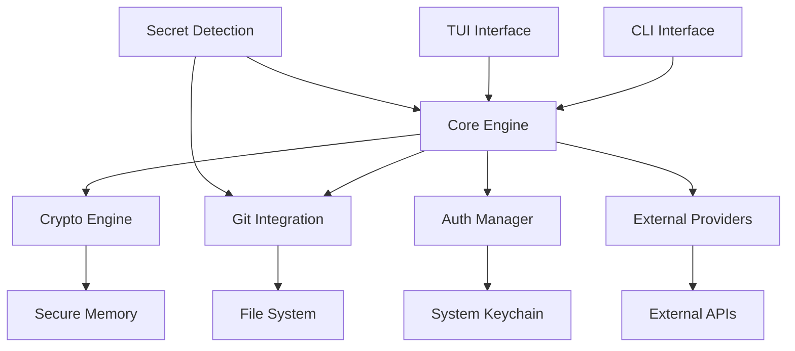

# CargoCrypt Architecture

> **Zero-config, git-native secret management that feels like a natural cargo extension**

## Table of Contents

1. [Core Architecture](#core-architecture)
2. [Security Model](#security-model)
3. [Git Integration](#git-integration)
4. [Performance Strategy](#performance-strategy)
5. [CLI Interface](#cli-interface)
6. [TUI Design](#tui-design)
7. [Cross-platform Considerations](#cross-platform-considerations)

## Core Architecture

### Module Overview

```
cargocrypt/
├── core/           # Core business logic and orchestration
├── crypto/         # Encryption, key derivation, secure operations
├── git/            # Git repository integration and operations
├── auth/           # Authentication and access control
├── providers/      # External secret provider integrations
├── detection/      # Secret detection and scanning
├── tui/            # Terminal user interface
└── cli/            # Command-line interface
```

### Data Flow Architecture



### Core Dependencies

```rust
// Core architecture dependencies
[dependencies]
chacha20poly1305 = "0.10"    # Memory-safe AEAD encryption
argon2 = "0.5"               # Secure key derivation
git2 = "0.18"                # Git operations
ratatui = "0.25"             # TUI framework
clap = "4.4"                 # CLI parsing
tokio = "1.35"               # Async runtime
serde = "1.0"                # Serialization
keyring = "2.3"              # Cross-platform keychain
zeroize = "1.7"              # Memory zeroing
```

## Security Model

### Encryption Architecture

```rust
// Primary encryption: ChaCha20-Poly1305
struct SecretVault {
    // Encrypted with user's master key
    secrets: HashMap<String, EncryptedSecret>,
    // Metadata (not encrypted)
    metadata: VaultMetadata,
}

struct EncryptedSecret {
    // ChaCha20-Poly1305 encrypted content
    ciphertext: Vec<u8>,
    // Authentication tag
    tag: [u8; 16],
    // Unique nonce per secret
    nonce: [u8; 12],
    // Optional expiration
    expires_at: Option<SystemTime>,
}
```

### Key Derivation Strategy

```rust
// Argon2id for key derivation from user passphrase
struct KeyDerivation {
    // High-entropy salt (stored in git)
    salt: [u8; 32],
    // Argon2id parameters
    params: Argon2Params {
        memory: 65536,    // 64MB memory
        iterations: 3,    // 3 iterations
        parallelism: 4,   // 4 parallel lanes
        variant: Argon2id,
    },
}

// Master key derivation
fn derive_master_key(passphrase: &str, salt: &[u8]) -> SecureKey {
    Argon2::new(Algorithm::Argon2id, Version::V0x13, params)
        .hash_password(passphrase.as_bytes(), salt)
        .expect("Key derivation failed")
}
```

### Secure Storage Model

```rust
// Three-tier storage approach
enum StorageLocation {
    // Encrypted secrets in git repository
    GitVault(PathBuf),
    // Local cache for performance
    LocalCache(PathBuf),
    // System keychain for master key
    SystemKeychain,
}

// Secure memory handling
struct SecureMemory<T> {
    data: Box<[T]>,
    // Automatic zeroing on drop
    _phantom: PhantomData<fn() -> T>,
}

impl<T> Drop for SecureMemory<T> {
    fn drop(&mut self) {
        // Zero memory before deallocation
        self.data.zeroize();
    }
}
```

### Access Control

```rust
// Role-based access control
#[derive(Debug, Clone)]
enum AccessLevel {
    Read,           // Can read existing secrets
    Write,          // Can create/update secrets
    Admin,          // Can manage vault settings
    Owner,          // Full control including deletion
}

struct AccessPolicy {
    // Git-based identity
    git_identity: String,
    // Access level for this user
    level: AccessLevel,
    // Optional expiration
    expires_at: Option<SystemTime>,
}
```

## Git Integration

### Repository Structure

```
.cargocrypt/
├── vault.encrypted         # Main encrypted vault file
├── manifest.toml           # Vault metadata and configuration
├── access.toml             # Access control policies
├── .gitignore              # Prevent accidental exposure
└── providers/              # External provider configurations
    ├── aws.toml
    ├── azure.toml
    └── gcp.toml
```

### Git-Native Operations

```rust
// Git integration engine
struct GitIntegration {
    repo: Repository,
    vault_path: PathBuf,
    branch: String,
}

impl GitIntegration {
    // Atomic vault updates with git commits
    async fn update_vault(&mut self, vault: &SecretVault) -> Result<()> {
        // 1. Encrypt and serialize vault
        let encrypted_data = self.encrypt_vault(vault).await?;
        
        // 2. Write to temporary file
        let temp_path = self.vault_path.with_extension("tmp");
        tokio::fs::write(&temp_path, encrypted_data).await?;
        
        // 3. Atomic rename
        tokio::fs::rename(temp_path, &self.vault_path).await?;
        
        // 4. Git commit
        self.commit_changes("Update secrets vault").await?;
        
        Ok(())
    }
    
    // Conflict resolution for concurrent updates
    async fn resolve_conflicts(&mut self) -> Result<SecretVault> {
        // Three-way merge strategy for secret vaults
        let base = self.get_merge_base().await?;
        let ours = self.load_vault("HEAD").await?;
        let theirs = self.load_vault("MERGE_HEAD").await?;
        
        // Merge secrets with conflict detection
        self.merge_vaults(base, ours, theirs).await
    }
}
```

### Distributed Sharing Model

```rust
// Multi-user sharing via git remotes
struct SharingPolicy {
    // Remote repositories for sharing
    remotes: Vec<RemoteRepo>,
    // Sync strategy
    sync_mode: SyncMode,
}

enum SyncMode {
    // Automatic push/pull on changes
    Automatic,
    // Manual sync only
    Manual,
    // Read-only (pull only)
    ReadOnly,
}

// Cross-team secret sharing
struct TeamVault {
    // Shared secrets accessible to team
    shared_secrets: HashMap<String, EncryptedSecret>,
    // Team member access policies
    members: Vec<AccessPolicy>,
    // Hierarchical organization support
    parent_vault: Option<String>,
}
```

## Performance Strategy

### Async-First Design

```rust
// Non-blocking I/O throughout
#[tokio::main]
async fn main() -> Result<()> {
    let runtime = Builder::new_multi_thread()
        .worker_threads(4)
        .enable_all()
        .build()?;
    
    // Concurrent operations
    let vault_future = load_vault();
    let git_future = check_git_status();
    let provider_future = sync_providers();
    
    // Wait for all operations
    let (vault, git_status, providers) = 
        tokio::join!(vault_future, git_future, provider_future);
    
    Ok(())
}
```

### SIMD Optimization

```rust
// SIMD-accelerated encryption where available
use chacha20poly1305::aead::stream;

struct OptimizedCrypto {
    cipher: ChaCha20Poly1305,
    // SIMD detection at runtime
    simd_available: bool,
}

impl OptimizedCrypto {
    // Vectorized encryption for large payloads
    async fn encrypt_large(&self, data: &[u8]) -> Result<Vec<u8>> {
        if self.simd_available && data.len() > 1024 {
            // Use SIMD stream encryption
            self.encrypt_stream_simd(data).await
        } else {
            // Standard encryption
            self.encrypt_standard(data).await
        }
    }
}
```

### Memory Management

```rust
// Zero-copy operations where possible
struct VaultCache {
    // Memory-mapped vault file
    mmap: Mmap,
    // LRU cache for decrypted secrets
    cache: LruCache<String, SecureMemory<String>>,
    // Automatic cache eviction
    last_access: HashMap<String, Instant>,
}

impl VaultCache {
    // Lazy loading with zero-copy reads
    fn get_secret(&mut self, key: &str) -> Result<&str> {
        if let Some(cached) = self.cache.get(key) {
            return Ok(cached);
        }
        
        // Memory-mapped read without full vault load
        let encrypted = self.read_secret_direct(key)?;
        let decrypted = self.decrypt_in_place(encrypted)?;
        
        self.cache.put(key.to_string(), decrypted);
        Ok(self.cache.get(key).unwrap())
    }
}
```

### Sub-Second Performance Targets

```rust
// Performance benchmarks and monitoring
struct PerformanceMetrics {
    // Target: < 100ms for vault load
    vault_load_time: Duration,
    // Target: < 50ms for secret retrieval
    secret_access_time: Duration,
    // Target: < 200ms for git operations
    git_operation_time: Duration,
    // Target: < 500ms for provider sync
    provider_sync_time: Duration,
}

// Built-in performance monitoring
impl CargoCrypt {
    async fn benchmark_operation<F, T>(&self, name: &str, op: F) -> Result<T>
    where
        F: Future<Output = Result<T>>,
    {
        let start = Instant::now();
        let result = op.await;
        let duration = start.elapsed();
        
        if duration > self.performance_targets.get(name) {
            warn!("Operation {} took {}ms (target: {}ms)", 
                  name, duration.as_millis(), 
                  self.performance_targets.get(name).as_millis());
        }
        
        result
    }
}
```

## CLI Interface

### Zero-Config Command Structure

```rust
// Cargo-style subcommands
#[derive(Parser)]
#[command(name = "cargocrypt")]
#[command(about = "Zero-config secret management for Rust projects")]
struct Cli {
    #[command(subcommand)]
    command: Commands,
}

#[derive(Subcommand)]
enum Commands {
    /// Initialize secret vault in current project
    Init {
        #[arg(long)]
        git_remote: Option<String>,
    },
    
    /// Add a new secret
    Add {
        name: String,
        #[arg(short, long)]
        value: Option<String>,
        #[arg(long)]
        from_file: Option<PathBuf>,
        #[arg(long)]
        from_env: Option<String>,
    },
    
    /// Get a secret value
    Get {
        name: String,
        #[arg(short, long)]
        format: Option<OutputFormat>,
    },
    
    /// List all secrets
    List {
        #[arg(short, long)]
        pattern: Option<String>,
        #[arg(long)]
        show_metadata: bool,
    },
    
    /// Remove a secret
    Remove {
        name: String,
        #[arg(short, long)]
        force: bool,
    },
    
    /// Sync with external providers
    Sync {
        #[arg(short, long)]
        provider: Option<String>,
        #[arg(long)]
        dry_run: bool,
    },
    
    /// Open interactive TUI
    Tui,
    
    /// Show vault status
    Status,
}
```

### Intelligent Defaults

```rust
// Auto-detection and zero-config setup
struct AutoConfig {
    // Detect project type
    project_type: ProjectType,
    // Auto-discover git repository
    git_repo: Option<Repository>,
    // Detect CI/CD environment
    ci_environment: Option<CiProvider>,
}

impl AutoConfig {
    // Smart initialization based on context
    async fn auto_init() -> Result<VaultConfig> {
        let config = VaultConfig {
            // Use project name as vault identifier
            vault_id: Self::detect_project_name()?,
            // Auto-configure git integration
            git_integration: Self::setup_git_integration().await?,
            // Detect and configure relevant providers
            providers: Self::detect_providers().await?,
            // Sensible encryption defaults
            crypto_config: Self::default_crypto_config(),
        };
        
        Ok(config)
    }
}
```

### Environment Integration

```rust
// Seamless environment variable integration
impl EnvironmentIntegration {
    // Export secrets as environment variables
    fn export_env(&self, secrets: &[String]) -> Result<()> {
        for secret_name in secrets {
            let value = self.vault.get_secret(secret_name)?;
            env::set_var(secret_name, value);
        }
        Ok(())
    }
    
    // Integration with cargo run
    fn setup_cargo_integration(&self) -> Result<()> {
        // Create .cargo/config.toml with environment setup
        let cargo_config = CargoConfig {
            env: self.vault.list_secrets()?
                .into_iter()
                .map(|name| (name.clone(), format!("$CARGOCRYPT_{}", name)))
                .collect(),
        };
        
        cargo_config.write_to_file(".cargo/config.toml")?;
        Ok(())
    }
}
```

## TUI Design

### Real-Time Interface Architecture

```rust
// Event-driven TUI with real-time updates
struct TuiApp {
    // Application state
    state: AppState,
    // Event handlers
    event_handler: EventHandler,
    // Real-time vault monitoring
    vault_watcher: VaultWatcher,
    // Terminal interface
    terminal: Terminal<CrosstermBackend<Stdout>>,
}

#[derive(Debug, Clone)]
enum AppEvent {
    // User input events
    KeyPress(KeyEvent),
    // File system events
    VaultChanged,
    // Git events
    RemoteUpdate,
    // Provider sync events
    ProviderSync(Provider, SyncResult),
    // Timer events
    RefreshTimer,
}
```

### Layout and Navigation

```rust
// Hierarchical navigation structure
struct TuiLayout {
    // Main panels
    panels: Vec<Panel>,
    // Current focus
    active_panel: usize,
    // Navigation state
    nav_stack: Vec<NavigationState>,
}

enum Panel {
    // Secret list with search/filter
    SecretList {
        secrets: Vec<SecretSummary>,
        filter: String,
        selected: usize,
    },
    
    // Secret detail view
    SecretDetail {
        secret: DetailedSecret,
        mode: ViewMode,
    },
    
    // Git status and operations
    GitStatus {
        status: GitStatus,
        pending_changes: Vec<Change>,
    },
    
    // Provider sync status
    ProviderPanel {
        providers: Vec<ProviderStatus>,
        sync_progress: Option<SyncProgress>,
    },
    
    // Help and shortcuts
    Help {
        current_context: HelpContext,
    },
}
```

### Keyboard Navigation

```rust
// Vim-inspired keyboard shortcuts
impl KeyHandler for TuiApp {
    fn handle_key(&mut self, key: KeyEvent) -> Result<EventResult> {
        match key.code {
            // Navigation
            KeyCode::Char('j') | KeyCode::Down => self.move_down(),
            KeyCode::Char('k') | KeyCode::Up => self.move_up(),
            KeyCode::Char('h') | KeyCode::Left => self.move_left(),
            KeyCode::Char('l') | KeyCode::Right => self.move_right(),
            
            // Actions
            KeyCode::Enter => self.activate_selected(),
            KeyCode::Char('a') => self.add_secret(),
            KeyCode::Char('d') => self.delete_secret(),
            KeyCode::Char('e') => self.edit_secret(),
            KeyCode::Char('s') => self.sync_providers(),
            KeyCode::Char('g') => self.git_operations(),
            
            // Search and filter
            KeyCode::Char('/') => self.start_search(),
            KeyCode::Esc => self.clear_search(),
            
            // Quick actions
            KeyCode::Char('y') => self.copy_to_clipboard(),
            KeyCode::Char('r') => self.refresh_vault(),
            KeyCode::Char('?') => self.show_help(),
            KeyCode::Char('q') => self.quit(),
            
            _ => Ok(EventResult::Ignored),
        }
    }
}
```

### Real-Time Updates

```rust
// File system monitoring for live updates
struct VaultWatcher {
    watcher: RecommendedWatcher,
    event_sender: Sender<AppEvent>,
}

impl VaultWatcher {
    async fn start_watching(&mut self, vault_path: &Path) -> Result<()> {
        let sender = self.event_sender.clone();
        
        self.watcher.watch(vault_path, RecursiveMode::Recursive)?;
        
        // Handle file system events
        while let Some(event) = self.watcher.recv().await {
            match event {
                DebouncedEvent::Write(_) => {
                    sender.send(AppEvent::VaultChanged).await?;
                },
                DebouncedEvent::Remove(_) => {
                    sender.send(AppEvent::VaultChanged).await?;
                },
                _ => {}
            }
        }
        
        Ok(())
    }
}
```

## Cross-Platform Considerations

### Platform-Specific Integrations

```rust
// Cross-platform keychain integration
#[cfg(target_os = "windows")]
mod windows {
    use windows::Security::Credentials::PasswordVault;
    
    pub struct WindowsKeychain {
        vault: PasswordVault,
    }
    
    impl Keychain for WindowsKeychain {
        fn store_key(&self, service: &str, key: &[u8]) -> Result<()> {
            // Use Windows Credential Manager
            let credential = PasswordCredential::new()?;
            credential.set_resource(service)?;
            credential.set_password_as_bytes(key)?;
            self.vault.add(&credential)?;
            Ok(())
        }
    }
}

#[cfg(target_os = "macos")]
mod macos {
    use security_framework::passwords::SecPassword;
    
    pub struct MacOSKeychain;
    
    impl Keychain for MacOSKeychain {
        fn store_key(&self, service: &str, key: &[u8]) -> Result<()> {
            // Use macOS Keychain Services
            SecPassword::set_generic_password(service, service, key)?;
            Ok(())
        }
    }
}

#[cfg(target_os = "linux")]
mod linux {
    use secret_service::{SecretService, EncryptionType};
    
    pub struct LinuxKeychain {
        service: SecretService,
    }
    
    impl Keychain for LinuxKeychain {
        fn store_key(&self, service: &str, key: &[u8]) -> Result<()> {
            // Use D-Bus Secret Service (GNOME Keyring, KDE Wallet)
            let collection = self.service.get_default_collection()?;
            collection.create_item(service, &[], key, false, "text/plain")?;
            Ok(())
        }
    }
}
```

### File System Considerations

```rust
// Cross-platform file handling
struct FileSystem {
    // Platform-specific path handling
    path_handler: Box<dyn PathHandler>,
    // File permissions management
    permissions: Box<dyn PermissionManager>,
}

trait PathHandler {
    fn vault_directory(&self) -> PathBuf;
    fn config_directory(&self) -> PathBuf;
    fn temp_directory(&self) -> PathBuf;
}

#[cfg(windows)]
impl PathHandler for WindowsPathHandler {
    fn vault_directory(&self) -> PathBuf {
        // %APPDATA%\cargocrypt
        dirs::config_dir()
            .unwrap_or_else(|| PathBuf::from("."))
            .join("cargocrypt")
    }
}

#[cfg(unix)]
impl PathHandler for UnixPathHandler {
    fn vault_directory(&self) -> PathBuf {
        // ~/.config/cargocrypt or $XDG_CONFIG_HOME/cargocrypt
        dirs::config_dir()
            .unwrap_or_else(|| home_dir().unwrap().join(".config"))
            .join("cargocrypt")
    }
}
```

### Performance Optimizations by Platform

```rust
// Platform-specific optimizations
#[cfg(target_os = "linux")]
mod linux_optimizations {
    use io_uring::{IoUring, opcode, types};
    
    // io_uring for high-performance I/O on Linux
    pub struct LinuxAsyncIO {
        ring: IoUring,
    }
    
    impl AsyncFileOperations for LinuxAsyncIO {
        async fn read_vault_async(&mut self, path: &Path) -> Result<Vec<u8>> {
            // Use io_uring for zero-copy I/O
            let entry = opcode::Read::new(fd, buf.as_mut_ptr(), buf.len() as _)
                .build();
            
            unsafe { self.ring.submission().push(&entry)? };
            self.ring.submit_and_wait(1)?;
            
            Ok(buf)
        }
    }
}

#[cfg(target_os = "windows")]
mod windows_optimizations {
    use winapi::um::ioapiset::GetOverlappedResult;
    
    // IOCP for Windows async I/O
    pub struct WindowsAsyncIO {
        completion_port: HANDLE,
    }
    
    impl AsyncFileOperations for WindowsAsyncIO {
        async fn read_vault_async(&mut self, path: &Path) -> Result<Vec<u8>> {
            // Use Windows I/O Completion Ports
            // Implementation details...
            todo!()
        }
    }
}
```

## Implementation Phases

### Phase 1: Core Foundation (MVP)
- ✅ Basic vault encryption/decryption
- ✅ Git integration for storage
- ✅ Simple CLI interface
- ✅ Cross-platform keychain integration

### Phase 2: Advanced Features
- 🔄 TUI implementation
- 🔄 External provider integrations
- 🔄 Multi-user sharing
- 🔄 Performance optimizations

### Phase 3: Enterprise Features
- 📋 Advanced access controls
- 📋 Audit logging
- 📋 Compliance tools
- 📋 Enterprise integrations

### Phase 4: Ecosystem Integration
- 📋 Cargo plugin
- 📋 IDE extensions
- 📋 CI/CD integrations
- 📋 Docker/container support

## Success Metrics

### Performance Targets
- **Vault Load**: < 100ms for typical vault (100 secrets)
- **Secret Access**: < 50ms for cached secrets
- **Git Operations**: < 200ms for commit/push
- **Provider Sync**: < 500ms for up to 10 providers
- **TUI Responsiveness**: < 16ms frame time (60 FPS)

### User Experience Goals
- **Zero-config setup**: Works out of the box for 90% of Rust projects
- **Natural integration**: Feels like native cargo functionality
- **Intuitive CLI**: Common operations discoverable without documentation
- **Reliable sync**: Conflict-free sharing for teams < 20 people
- **Secure by default**: No accidental secret exposure

### Security Assurance
- **Memory safety**: No secret data in swap or core dumps
- **Forward secrecy**: Key rotation doesn't compromise old secrets
- **Access auditing**: All secret access logged and verifiable
- **Conflict resolution**: Merge conflicts preserve security
- **Provider isolation**: Compromise of one provider doesn't affect others

---

This architecture prioritizes developer experience while maintaining strong security guarantees. The modular design allows for incremental implementation and easy extension, while the git-native approach ensures CargoCrypt feels like a natural part of the Rust development workflow.